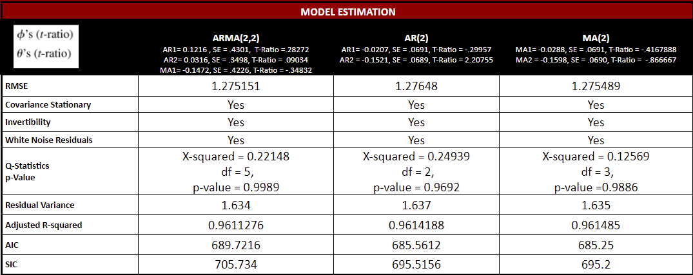

```{r setup, include=FALSE}
knitr::opts_chunk$set(echo = TRUE, warning = FALSE, message = FALSE)

library(readxl)
library(forecast)
library(tidyverse)
library(tseries)
library(fpp2)
library(stats)
library(ggpubr)
library(scales)
library(datplot)
library(kableExtra)
library(ggannotate)
library(lmtest)
library(TSstudio)
library(plotly)
library(DT)
library(urca)
```

Our data is FRED creating an index (2007=100) of aggregate weekly hours reported on a monthly basis. The indexes of aggregate weekly hours are calculated by dividing the current month's aggregate hours by the average of the 12 monthly figures, for the base year (2007).

# Data Load 
```{r, warning=FALSE}
# Read in Data
working_hours = read_excel("../data/ch10_Weekly_Hours.xls")

# Added First Difference and year/month variable to base dataset.
working_hours <- working_hours %>%
  mutate(year = year(observation_date),
         month = month(observation_date),
         first_difference_index =
         working_hours$hours_worked_index-lag(working_hours$hours_worked_index))

# Create a time series object
working_hours_ts <- ts(working_hours$hours_worked_index, 
                      frequency = 12,
                      start = c(2006, 3))

# Create First Difference of Hours Worked Index
working_hours_diff = diff(working_hours_ts)
```

#1. Why do you choose this time series?

We chose this time series to gain an understanding of how the working hours has changed over time and to help predict fluctuations of these changes.

#2. Why should we care about the forecasts of this time series?

Having an understanding of where working hours are heading can help us as a people understand if people's productivity is increasing or decreasing. If there are less opportunities within a country the working hours of their people will likely decline. Whereas on the other side a healthy economy may have stable or increasing hours of work. Economies are fueled by discretionary income and is associated with number of working hours.

#3. The time series has been accurately plotted and appropriately labeled.

EDA Raw Data
```{r, warning=FALSE}
plot_work_hours <- ggplot(working_hours, aes(x = observation_date, 
                                             y = hours_worked_index)) +
  geom_line(size = 1) +
  stat_smooth(color = "blue", size =.4) +
  geom_rect(aes(xmin=as.POSIXct('2020-02-01'), xmax=as.POSIXct('2020-04-01'), ymin=-Inf, 
                ymax=Inf),linetype = 'dashed',color="light green", fill = 'light green', alpha=.01) +
  
  geom_rect(aes(xmin=as.POSIXct('2007-12-01'), xmax=as.POSIXct('2008-07-01'), ymin=-Inf, ymax=Inf), 
            linetype = 'dashed',color="light green", fill = 'light green', alpha=.01) +
  geom_hline(yintercept = mean(working_hours$hours_worked_index), linetype = "dashed", color = "red") +
   scale_x_datetime(labels = date_format("%Y"),breaks = "1 year") +
  labs(x = 'Date', y = 'Indexed Working Hours',
      title = 'Mar 2006 - MAR 2023 Agg. Weekly Work Hours Index Indexed(2007=100)', 
      subtitle =  'Recession(s) highlighed  Red Dashed Line = Time Series Mean') +
  theme(axis.text.y=element_text(face="bold", color="black", size=10, angle=0),
      axis.ticks.y=element_blank(),
      axis.title = element_text(face = "bold", color="black", size=10),
      axis.text.x = element_text(face = "bold", color="black", size=10),
      panel.background =element_rect('White'),
      legend.position = "none")
plot_work_hours
```

#4. The characteristics of the time series, such as frequency, trends, seasonality, and anomalies, have been clearly described, providing a comprehensive understanding of its temporal behavior.

```{r}
# Histogram - Basic 
hist_base <- gghistogram(working_hours_ts, fill = "blue", color = 'black', alpha = 0.50,
                    title ='Mar 2006 - MAR 2023', 
                    subtitle = 'Agg. Weekly Work Hours Index Indexed(2007=100)',
                    xlab = 'Index Value: Base (2007 = 100)', ylab = 'Frequency')  +
  geom_density(color = 'red' )

# Histogram - Basic for First Difference of Hours Worked Index
hist_diff <- gghistogram(working_hours_diff, fill = "blue", color = 'black', alpha = 0.50,
                    title ='First Difference: Mar 2006 - MAR 2023   n = 205', 
                    subtitle = 'Agg. Weekly Work Hours Index Indexed(2007=100)',
                    xlab = 'Index Value: Base (2007 = 100)', ylab = 'Frequency')  +
                    xlim(-5,5) +
  geom_density(color = 'red' )

# Combination of Histograms with Raw Data, First Difference & Second Difference
hist_final <- subplot(ggplotly(hist_base), ggplotly(hist_diff))
hist_final
```

```{r}
# Heatmap: Base Time Series by year and month raw data
ts_heatmap(working_hours_ts, 
           title = "Mar 2006 - MAR 2023 Agg. Weekly Work Hours Index Indexed(2007=100)")
```

```{r}
# Base + First Difference of Hours Worked Index and Seasonality Check
base_boxplot <- ts_seasonal(working_hours_ts, type = "box", 
                title = "Raw Data Seasonality/Cycles by Month All Years, Base 2007 = 100")
base_boxplot
first_diff_boxplot <- ts_seasonal(working_hours_diff, type = "box",
  title = "Raw & First Difference Seasonality/Cycles by Month All Years, Base 2007 = 100")
first_diff_boxplot
comb_box <- subplot(ggplotly(base_boxplot), ggplotly(first_diff_boxplot), nrows = 2, shareX = TRUE)
comb_box
```

```{r}
ts_seasonal(working_hours_ts, type = "box", 
            title = "Raw Data Seasonality/Cycles by Month All Years, Base 2007 = 100")

decomp_work_hours_ts <- ts_decompose(working_hours_ts, "additive", showline = TRUE)
decomp_work_hours_ts

# First Difference Hours Worked Index decomposition
decomp_work_hours_diff <- ts_decompose(working_hours_diff, "additive", showline = TRUE)
decomp_work_hours_diff
```

The width and height of seasonal cycles over time is predictable and trend is fairly linear with the first difference of hours worked, or seasonal variation is relatively constant over time. We'll check if differencing of seasonality required using nsdiffs() function. 

```{r}
## Seasonality check 
season_raw <- ggseasonplot(working_hours_ts) +
  ylab("Index Hours") +
  ggtitle("Raw:All Years Seasonal Plot") +
  theme_classic2()

# First Difference of Hours Worked Index and Seasonality Check
season_first_diff <- ggseasonplot(working_hours_diff) +
  ylab("Index Hours") +
  ggtitle("Base Vs.First Difference: Seasonal Plot All Years") +
  theme_classic2()

# Combined Plot of Raw vs. First Differenced Hours Worked Index
subplot(ggplotly(season_raw), ggplotly(season_first_diff), nrows = 2, shareX = TRUE)
```

# The Augmented Dickey-Fuller tests have been accurately performed, and the obtained test results have been correctly interpreted.

```{r}
adf_base <- ur.df(working_hours_ts, type = "none", selectlags = "AIC")
summary(adf_base)
```

The test statistic is higher than all tau values at the 1, 5 and 10 percent and p-value is .6714. Transforming working hours index with the first difference of working hours is pragmatic to achieve stationarity. 

```{r}
df_diff_data = ur.df(working_hours_diff, type = "none", selectlags = "AIC", lags =0)

summary(df_diff_data)
```

t-stat is -14.474, which is < tau1 at 1pct-level, a p-value = 2.2e-16 and AR^2 = 0.5067. Dickey-Fuller with a transformation on the first difference of working hours suggests that we have stationary data now, as the p-value is below 0.01 and test statitic of -14.474 is less than critical value of -2.58 at 99 percent confidence interval, we can reject the null hypothesis that this data is not stationary. Taking the working hours index and transforming it using first difference is sufficient for stationary time series.

```{r}
## Comparison of First Difference vs. Raw Data
interactive_raw_first_difference_plot <- cbind(working_hours_ts,working_hours_diff)
ts_plot(interactive_raw_first_difference_plot, width = 3, type = "multiple",
        title = "Raw Vs. First Difference Agg. Weekly Work Hours Index Indexed(2007=100)"
        , Xtitle = "Date", Ytitle = "Index Value - Base 2007 = 100",
        color = "gold", Xgrid = FALSE, Ygrid = FALSE,
        ) %>%
    layout(paper_bgcolor = "black",
         plot_bgcolor = "black",
         font = list(color = "white"),
         yaxis = list(linecolor = "white",
                      zerolinecolor = "white",
                      gridcolor= "white"),
         xaxis = list(linecolor = "white",
                      zerolinecolor = "white",
                      gridcolor= "white")
         )   
```

# The ACF and PACF correlograms have been accurately plotted, and a coherent explanation is provided to justify the selection of AR or MA process orders based on these correlograms.

```{r}
acf_12_plot <- ggAcf(working_hours_ts, lag.max = 12,  
             main = "ACF Base Time Series")
pacf_12_plot <- ggPacf(working_hours_ts, lag.max = 12,
               main = "PACF Base Time Series")

acf_pacf_12_plot <- ggarrange(acf_12_plot, pacf_12_plot, nrow = 2) 

# Correlogram of first difference index of hours worked
acf_12_diff <- ggAcf(working_hours_diff, lag.max = 12,  
             main = "First Difference ACF - Lag = 12")
pacf_12_diff <- ggPacf(working_hours_diff, lag.max = 12,
               main = "First Difference PACF - Lag = 12")

acf_pacf_12_diff <- ggarrange(acf_12_diff, pacf_12_diff, nrow = 2)

acf_pacf_combo <- ggarrange(acf_pacf_12_plot, acf_pacf_12_diff, nrow = 1, ncol = 2)
acf_pacf_combo
```

With ACF and PACF spikes at the second lag suggests that a combined ARMA model of order 2 may be appropriate to consider. The MA(2), AR(2) and ARMA(2,2) models are still intuitive models to further research for modeling as the PACF is alternating through lag periods with the spikes at lag 2.

# ARMA(2,2)
```{r}
# Fit an ARMA model with order of 2 for both terms with the first difference.
model_ARMA212 = arima(working_hours_ts, order = c(2, 1, 2))
summary(model_ARMA212) 
coeftest(model_ARMA212)
autoplot(model_ARMA212)
BIC(model_ARMA212)

# R-Squared 
n = length(working_hours_ts)
arma22_R2 = cor(fitted(model_ARMA212), working_hours_ts)^2
arma22_AR2 = 1 - (1-arma22_R2) * (n - 1) / (n - 4 - 1)
arma22_R2 
arma22_AR2 # 0.9611276
```

So we have a reasonably good fit here with a ARMA(2,2) model the AIC is 689.72 which is relatively low, adjusted r-squared of 0.9611276, and phi parameters are both < 1, suggesting a good fit. As well MSE is 1.62601 which suggests that this models predictions are roughly 1.27 units, or in our case hours, away from actual values. This is a good start.

# AR(2)
```{r}
# Fit an AR model with order of 2 for both terms with the first difference.
model_AR210 = arima(working_hours_ts, order = c(2, 1, 0))
summary(model_AR210)
coeftest(model_AR210)
autoplot(model_AR210)
BIC(model_AR210)

# R-Squared
n = length(working_hours_ts)
ar2_R2 = cor(fitted(model_AR210), working_hours_ts)^2  
ar2_AR2 = 1 - (1-ar2_R2) * (n - 1) / (n - 2 - 1)
ar2_R2
ar2_AR2 # 0.9614188
```

The AIC is 685.56, both phi parameters are < 1, our adjusted r-squared is 0.9614188 and MSE is 1.630474. The AIC was lower than ARMA(2,2) and adjusted r-squared was marginally better.  

# MA(2)
```{r}
# Fit an MA model with order of 2 for both terms with the first difference.
model_MA012 = arima(working_hours_ts, order = c(0, 1, 2))
summary(model_MA012)
coeftest(model_MA012)
autoplot(model_MA012) # Pure MA models may or may not be invertible
BIC(model_MA012)

# R-Squared
n = length(working_hours_ts)
ma2_R2 = cor(fitted(model_MA012), working_hours_ts)^2  
ma2_AR2 = 1 - (1 - ma2_R2) * (n - 1) / (n - 2 - 1)
ma2_R2
ma2_AR2 # 0.961485
```

The AIC is 685.25, much better than ARMA(2,2), but only marginally better than AR(2). The adjusted r-squared is 0.961485, just slightly lower than AR(2) and ARMA(2,2), and MSE was 1.626872.

Our preferred models is AR(2) and MA(2) as they have the highest Adjusted R-squared and lowest AIC/SIC of the three models.

# The ACF and PAC correlograms of the residuals from each specification have been accurately plotted. Furthermore, the white noise property of the residuals has been verified using Q-tests. The test results have been correctly interpreted to determine whether the residuals exhibit the characteristics of white noise.

# ARMA(2,2) 
```{r}
# Residuals check ACF/PACF
check_res(model_ARMA212)

# Plot residuals in ACF/PACF
arma212_acf_residuals <- acf(model_ARMA212$residuals, main = "ACF Residuals")
arma212_pacf_residuals <- pacf(model_ARMA212$residuals, main = "PACF Residuals")

# combine ACF/PACF with residuals
par(mfrow = c(3,1) , mex = 0.6, cex = 0.8, cex.main = .9)
plot(arma212_acf_residuals)
plot(arma212_pacf_residuals)
qqnorm(residuals(model_ARMA212), main = 'ARMA(2,1,2) Residuals')
qqline(model_ARMA212$residuals, col = 'red')
```

```{r}
# Q-Test
r_2_box_test <- Box.test(model_ARMA212$residuals, lag = 5, type = "Ljung")
r_2_box_test

QTest<-numeric(5)
for (i in 1:5){ 
  qt <- Box.test(model_ARMA212$residuals, lag=i, type="Ljung")
  QTest[i]=qt$statistic
} 

QTest 
plot(QTest, main = "ARMA(2,1,2) Q Test", xlab = "lag", ylab = "p-value")
abline(h = .05, col = "red", lty = 3)
```

The Ljung-Box statistic is used to see if all underlying population auto correlations for the error may be zero. With an X-squared value of 0.22148 and a p-value of 0.9968 given 5 lags, which is well above 0.05 -a significant threshold for non-zero auto correlations that rejects null that residuals are independently distributed.

# AR(2) 
```{r}
# Residuals check ACF/PACF
check_res(model_AR210) 

# Plot residuals in ACF/PACF
ar2_acf_residuals <- acf(model_AR210$residuals, main = "ACF Residuals")
ar2_pacf_residuals <- pacf(model_AR210$residuals, main = "PACF Residuals")

# combine ACF/PACF with residuals using qqnorm.
par(mfrow = c(3,1) , mex = 0.6, cex = 0.8, cex.main = .9)
plot(ar2_acf_residuals)
plot(ar2_pacf_residuals)
qqnorm(residuals(model_AR210), main = 'ARMA(2,1,0) Residuals')
qqline(model_AR210$residuals, col = 'red')
```

```{r}
# Q-Test
r_2_box_test <- Box.test(model_AR210$residuals, lag = 3, type = "Ljung")
r_2_box_test 

QTest<-numeric(3)
for (i in 1:3){ 
  qt <- Box.test(model_AR210$residuals, lag=i, type="Ljung")
  QTest[i]=qt$statistic
} 

QTest 
plot(QTest, main = "AR2 Q Test", xlab = "lag", ylab = "p-value")
abline(h = .05, col = "red", lty = 3)
```

Our Q-test using Ljung was 0.24938500 and p-value looked good at 0.9692 with three lags.

# MA(2)
```{r}
# Residuals check ACF/PACF
check_res(model_MA012)
# Plot residuals in ACF/PACF
MA012_acf_residuals <- acf(model_MA012$residuals, main = "ACF Residuals")
MA012_pacf_residuals <- pacf(model_MA012$residuals, main = "PACF Residuals")

# combine ACF/PACF with residuals using qqnorm.
par(mfrow = c(3,1) , mex = 0.6, cex = 0.8, cex.main = .9)
plot(MA012_acf_residuals)
plot(MA012_pacf_residuals)
qqnorm(residuals(model_MA012), main = 'ARMA(2,1,0) Residuals')
qqline(model_MA012$residuals, col = 'red')
```

```{r}
# Q-Test
r_2_box_test <- Box.test(model_MA012$residuals, lag = 3, type = "Ljung")
r_2_box_test # X-squared = 0.22148, df = 5, p-value = 0.9989 - No serial Correlations/residuals independently distributed

QTest<-numeric(3)
for (i in 1:3){ 
  qt <- Box.test(model_MA012$residuals, lag=i, type="Ljung")
  QTest[i]=qt$statistic
} 

QTest 
plot(QTest, main = "MA2 Q Test", xlab = "lag", ylab = "p-value")
abline(h = .05, col = "red", lty = 3)
```
The Ljung box test X-Squared was 0.12569 &  p-value looked good at 0.9886 at 3 lags.
 
To summarize, all of our residual checks look fairly good and we can feel confident that the residuals are white noise.
 
# The model estimation and evaluation results have been accurately summarized in a table format, similar to Table 8.2 on page 214.

```{r}

```

# The multistep forecasts, along with their corresponding bands, have been accurately plotted. The interpretation of the results are provided

# ARMA(2,2)
```{r}
# Forecast 6 months
fcast_ARMA212 = forecast(model_ARMA212, h=6)
summary(fcast_ARMA212)

# Data frame of Forecast
fcastarma22 <- as.data.frame(fcast_ARMA212) %>%
  select(`Point Forecast`)

# Interactive Plot
fcast_ARMA212_plot <- plot_forecast(fcast_ARMA212, title = "ARMA(2,1,2) h =6", 
                                 Ytitle = "index-Base 2007 = 100", Xtitle="Date")
fcast_ARMA212_plot
```

# AR(2)
```{r}
# Forecast 6 months
fcast_AR2 = forecast(model_AR210, h=6)
summary(fcast_AR2)

# Data frame of Forecast
fcastar2 <- as.data.frame(fcast_AR2) %>%
  select(`Point Forecast`)

# Interactive Chart
fcast_AR21_plot <- plot_forecast(fcast_AR2, title = "ARMA(2,1,0) h =6", 
                                Ytitle = "index-Base 2007 = 100", Xtitle="Date")
fcast_AR21_plot
```

# MA(2)
```{r}
# Forecast 6 months
fcast_MA012 <- forecast(model_MA012, h=6)
summary(fcast_MA012)

# Data frame of Forecast
fcastma2 <- as.data.frame(fcast_MA012) %>%
  select(`Point Forecast`)

# Interactive Chart
fcast_MA012_plot <- plot_forecast(fcast_MA012, title = "ARMA(0,1,2) h =6", 
                                 Ytitle = "index-Base 2007 = 100", Xtitle="Date")
fcast_MA012_plot
```

# For each model, correctly calculate the one-step ahead forecasts, the forecast errors, the loss using quadratic loss function

# Step 2 DTC Forecasting Environment
There are 204 observations and we'll be doing a 90% / 10% split, thus our estimation sample with have 184 observations and our prediction sample will have 21 observations. We'll be applying a fixed scheme that will produce only one estimate and does not allow for parameter updating. We'll be using a quadratic loss function, as penalty for over/under estimating forecast has equal penalty.

## Data Split into Train & Test Samples
```{r}
# split of time-series base time-series
length(working_hours_ts)
train <- window(working_hours_ts,start=c(2006,3),end=c(2021,6)) # 184 observations
test <- window(working_hours_ts, start=c(2021,7),end=c(2023,3)) # 21 observations
length(train)
length(test)
```

# ARMA(2,1,2)
```{r}
arma22 <- arima(train, order = c(2,1,2))
autoplot(arma22)
coeftest(arma22)
summary(arma22)
arma22fcast_acc_train <- as.data.frame(accuracy(arma22))

# Generate Forecast for Test Sample
arma22fcast <- Arima(test, model = arma22)
summary(arma22fcast)
arma22fcast_acc_test <- as.data.frame(accuracy(arma22fcast))

# Extract Fitted Values from Forecast
arma22_forecast <- round(arma22fcast$fitted, digits = 5)

# Calculate Errors with Test Sample
arma22error <- round(test - arma22fcast$fitted, digits = 5)

# Calculate Loss with Test Sample.
arma22_loss <- round(arma22error^2, digits = 5)

# Calculate MSE
arma22_mse <- round(mean(arma22_loss), digits = 5)

# MPE Test
arma22mpetest <- lm(arma22error ~ 1)
summary(arma22mpetest)

# Use Robust Standard Errors
coeftest(arma22mpetest, vcoc= vcocHC(arma22mpetest, type = 'HC0'))

# Run Information Efficiency (I.E) Test
arma22ietest <- lm(arma22error ~ arma22fcast$fitted)
summary(arma22ietest)
# IET  = Extract all info. from residuals and put into forecast.
# Residuals should not be correlated with forecast.

# Use Robust Standard Errors
coeftest(arma22ietest, vcoc= vcocHC(arma22ietest, type = 'HC0'))

# Create Data Table with Pertinent Values
arma22_df <- as.data.frame(format(cbind(test, arma22_forecast, arma22error, arma22_loss)
                                     , scientific = FALSE, nsmall = 5))
arma22_dt <- datatable(arma22_df, filter = "top", 
                          options = list(pageLength = nrow(test),autoWidth = TRUE),
                          caption = "ARMA(0,1,2) Forecast, Error & Loss")
arma22_dt

# Create Data Table for Pertinent Fit Metrics

fit_arma22_dt <- datatable(round(rbind(arma22fcast_acc_train, arma22fcast_acc_test), digits = 5), 
          options = list(pageLength = nrow(arma22_dt), autoWidth = TRUE),
          caption = "ARMA(2,1,2) Metrics In-Sample & Out-of-Sample")
fit_arma22_dt

# Interactive Plots
plot_arma22 <- cbind(test,arma22_forecast)
ts_plot(plot_arma22, width = 3,
        slider = FALSE, type = "single",
        Ytitle = "First Difference of Hours Worked Index",
        Xgrid = TRUE, Ygrid = TRUE,
        title = "ARMA(2,2) July 2021 - March 2023")
```

# ARMA(2,1,0)
```{r}
ar2 <- Arima(train, order = c(2,1,0))
autoplot(ar2)
coeftest(ar2)
summary(ar2)
ar2fcast_acc_train <- as.data.frame(accuracy(ar2))

# Generate Forecast for Test Sample
ar2fcast <- Arima(test, model = ar2)
summary(ar2fcast)
ar2fcast_acc_test <- as.data.frame(accuracy(ar2fcast))

# Extract Fitted Values from Forecast
ar2_forecast <- round(ar2fcast$fitted, digits = 5)

# Calculate Errors with Test Sample
ar2error <- round(test - ar2fcast$fitted, digits = 5)

# Calculate Loss with Prediction Sample.
ar2_loss <- round(ar2error^2, digits = 5)

# Calculate MSE
ar2_mse <- round(mean(ar2_loss), digits = 5)

# MPE Test
ar2mpetest <- lm(ar2error ~ 1)
summary(ar2mpetest)

# Use Robust Standard Errors
coeftest(ar2mpetest, vcoc= vcocHC(ar2mpetest, type = 'HC0'))

# Run Information Efficiency (I.E) Test
ar2ietest <- lm(ar2error ~ ar2fcast$fitted)
summary(ar2ietest)

# Use Robust Standard Errors
coeftest(ar2ietest, vcoc= vcocHC(ar2ietest, type = 'HC0'))

# Create Data Table with Pertinent Values
ar2_df <- as.data.frame(format(cbind(test, ar2_forecast, ar2error, ar2_loss)
                                     , scientific = FALSE, nsmall = 5))
ar2_dt <- datatable(ar2_df, filter = "top", 
                          options = list(pageLength = nrow(test),autoWidth = TRUE),
                          caption = "AR(2) Forecast, Error & Loss")
ar2_dt

# Create Data Table for Pertinent Fit Metrics
fit_ar2_dt <- datatable(round(rbind(ar2fcast_acc_train, ar2fcast_acc_test), digits = 5), 
          options = list(pageLength = nrow(ar2_dt), autoWidth = TRUE),
          caption = "ARMA(2) Metrics In-Sample & Out-of-Sample")
fit_ar2_dt

# Interactive Plots
plot_ar2 <- cbind(test,ar2_forecast)
ts_plot(plot_ar2, width = 3,
        slider = FALSE, type = "single",
        Ytitle = "First Difference of Hours Worked Index",
        Xgrid = TRUE, Ygrid = TRUE,
        title = "AR(2) July 2021 - March 2023")
```

## MA(2) 
```{r}
ma2 <- Arima(train, order = c(0,1,2))
autoplot(ma2)
coeftest(ma2)
summary(ma2)
ma2fcast_acc_train <- as.data.frame(accuracy(ma2))

# Generate Forecast for Test Sample
ma2fcast <- Arima(test, model = ma2)
summary(ma2fcast)
ma2fcast_acc_test <- as.data.frame(accuracy(ma2fcast))

# Extract Fitted Values from Forecast
ma2_forecast <- round(ma2fcast$fitted, digits = 5)

# Calculate Errors with Test Sample
ma2error <- round(test - ma2fcast$fitted, digits = 5)

# Calculate Loss with Test Sample
ma2_loss <- round(ma2error^2, digits = 5)

# Calculate MSE
ma2_mse <- round(mean(ma2_loss), digits = 5)

# MPE Test
ma2mpetest <- lm(ma2error ~ 1)
summary(ma2mpetest)

# Use Robust Standard Errors
coeftest(ma2mpetest, vcoc= vcocHC(ma2mpetest, type = 'HC0'))

# Run Information Efficiency (I.E) Test
ma2ietest <- lm(ma2error ~ ma2fcast$fitted)
summary(ma2ietest)

# Use Robust Standard Errors
coeftest(ma2ietest, vcoc= vcocHC(ma2ietest, type = 'HC0'))

# Create Data Table with Pertinent Values
ma2_df <- as.data.frame(format(cbind(test, ma2_forecast, ma2error, ma2_loss)
                                     , scientific = FALSE, nsmall = 5))
ma2_dt <- datatable(ma2_df, filter = "top", 
                          options = list(pageLength = nrow(test),autoWidth = TRUE),
                          caption = "MA(2) Forecast, Error & Loss")
ma2_dt

# Create Data Table for Pertinent Fit Metrics
fit_ma2_dt <- datatable(round(rbind(ma2fcast_acc_train, ma2fcast_acc_test), digits = 5), 
          options = list(pageLength = nrow(ma2_dt), autoWidth = TRUE),
          caption = "ARMA(2) Metrics In-Sample & Out-of-Sample")
fit_ma2_dt

# Interactive Plots
plot_ma2 <- cbind(test,ma2_forecast)
ts_plot(plot_ma2, width = 3,
        slider = FALSE, type = "single",
        Ytitle ="First Difference of Hours Worked Index",
        Xgrid = TRUE, Ygrid = TRUE,
        title = "MA(2) July 2021 - March 2023")
```

# Simple Average 4 Naive Forecast
```{r}
f4 <-numeric(21) # Test Sample = 21

for (i in 1:21){ 
  f4[i]<-(working_hours_ts[181+i]+working_hours_ts[182+i]+
              working_hours_ts[183+i]+working_hours_ts[184+i])/4
}

f4error <- round(test-f4, digits = 3)
f4loss <- round(f4error^2, digits = 3)
mse_f4 <- mean(f4error^2) 
mpe_test_f4 <- lm(f4error~1) 
summary(mpe_test_f4) 

# Use Robust Standard Errors
coeftest(mpe_test_f4, vcoc= vcocHC(mpe_test_f4, type = 'HC0'))

# Combine Test, Forecast, Error, Loss into one Data Frame
final_f4 <- datatable(cbind(test, f4, f4error, f4loss), 
                      caption = "Simple Average 4 Naive Forecast: July 2021 - March 2023")
final_f4 
IET_test <- lm(f4error ~ f4)
summary(IET_test)

# Use Robust Standard Errors
coeftest(IET_test, vcoc= vcocHC(ma2ietest, type = 'HC0'))

# Create Data Table for Pertinent Fit Metrics
fit_MA4_metrics <- datatable(round(accuracy(f4, test), digits = 5))
fit_MA4_metrics

# Combine Test, Forecast, Error, MSE, Loss into One Data Frame
f4_dt <- datatable(round(cbind(test, f4, f4error, f4loss), digits = 5)) # create a df from test
f4_dt

# Plots
f4_plot <- cbind(test, f4)

ts_plot(f4_plot, width = 3, slider = FALSE, type = "single", Ytitle = "First Difference of Working Hours Index",
        Xgrid = TRUE, Ygrid = TRUE, title = "Simple Naive Last 4 Observations Predicted Vs. Actual")
```

# Graph of ARMA(2,2), AR(2), MA(2) & Simple Naive Last 4 Observations Graph
```{r}
# Bind All Forecasts for ARMA(2,2), AR(2), MA(2) and Simple Naive 4 together
our_models <- cbind(test, arma22_forecast, ar2_forecast,ma2_forecast,f4)
plot_our_models <- ts_plot(our_models, slider = FALSE, type = "single",
                          Xgrid = TRUE, Ygrid = TRUE,
                          title = "All Forecasts July 2021 = March 2023")
plot_our_models
```

# The forecast optimality tests, including the mean percentage error (MPE) and informational efficiency tests, have been correctly implemented for each model. Additionally, the mean squared error (MSE) has been accurately calculated and used correctly in choosing models.

```{r}
knitr::include_graphics("../figures/optimality_of_forecast_table.png")
```

# The combined forecasts have been correctly conducted using three linear combination schemes. The weights and MSE of these three combinations of forecasts have been accurately summarized in a table format, similar to Table 9.8 on page 246.

# Equal Weight Combined Forecast
```{r}
# Combine the forecasts using the OLS weighted combination scheme --------------
# 4 models, so n=4 and each weight is 1/n = 0.25

ew_comb_fcast <- numeric(21)

for (i in 1:21) {
  ew_comb_fcast[i] <- 0.25 * arma22_forecast[i] + 0.25 * ar2_forecast[i] +
                        0.25 * ma2_forecast[i] + 0.25 * f4[i]
}

# Error, Loss, MSE and MPE test
ew_error <- round(test-ew_comb_fcast, digits = 3)
ew_loss <- round(ew_error^2, digits = 3)
ew_mse_combo <- mean(ew_error^2)  
ew_mpe_test_combo <- lm(ew_error~1)
summary(ew_mpe_test_combo)

# Use Robust Standard Errors
coeftest(ew_mpe_test_combo, vcoc= vcocHC(ew_mpe_test_combo, type = 'HC0'))

ew_IET_test <- lm(ew_error ~ ew_comb_fcast)
summary(ew_IET_test)

# Use Robust Standard Errors
coeftest(ew_IET_test, vcoc= vcocHC(ew_IET_test, type = 'HC0'))

# Combine Test, Equal Weight Forecast, Error, Loss into table
ew_combo_fcast21_df <- datatable(round(cbind(test,ew_comb_fcast, ew_error, ew_loss), digits = 3),
  caption = "July 2021-March 2023: Equal Weight ARMA(2,2), AR(2), MA(2), Simple Naive Last 4 observations")
ew_combo_fcast21_df

# Create Data Table for Pertinent Fit Metrics
fit_ew_comb_metrics <- datatable(round(accuracy(ew_comb_fcast, test), digits = 5))
fit_ew_comb_metrics

# Plot Equal Weight Combined Forecast
ew_comb_plot <- cbind(test, ew_comb_fcast)

ew_plot <- ts_plot(ew_comb_plot, width = 3, slider = FALSE, type = "single", 
                    Ytitle = "First Difference of Working Hours Index",
                    Xtitle = "Date",
                    Xgrid = TRUE, Ygrid = TRUE, 
                    title = "July 2021-March 2023: Equal Weight ARMA(2,2), AR(2), MA(2), Simple Naive Last 4 observations")
ew_plot
```

# Inverse MSE Forecast
```{r}
imse_comb_fcast <- numeric(21)

imse_arma212 <- (1/arma22_mse) / ((1/arma22_mse) + (1/ar2_mse) + (1/ma2_mse) + (1/mse_f4))
imse_arma210 <- (1/ar2_mse) / ((1/ar2_mse) + (1/arma22_mse) + (1/ma2_mse) + (1/mse_f4))
imse_arma012 <- (1/ma2_mse) / ((1/ma2_mse) + (1/arma22_mse) + (1/ar2_mse) + (1/mse_f4))
imse_sma4 <- (1/mse_f4) / ((1/mse_f4) + (1/arma22_mse) + (1/ar2_mse) + (1/ma2_mse))

for (i in 1:21){
     imse_comb_fcast[i] <- (imse_arma212 * arma22_forecast[i] + 
                                  imse_arma210 * ar2_forecast[i] +
                                  imse_arma012 * ma2_forecast[i] +
                                  imse_sma4 * f4[i])
}

# Error, Loss, MSE and MPE test
imse_error <- round(test-imse_comb_fcast, digits = 3)
imse_loss <- round(imse_error^2, digits = 3)
imse_combo_mse <- mean(imse_error^2)
mpe_test_combo_inverse <- lm(imse_error~1)
summary(mpe_test_combo_inverse)

# Use Robust Standard Errors
coeftest(mpe_test_combo_inverse, vcoc= vcocHC(mpe_test_combo_inverse, type = 'HC0'))

imse_IET_test <- lm(imse_error ~ imse_comb_fcast)
summary(imse_IET_test)

# Use Robust Standard Errors
coeftest(IET_test, vcoc= vcocHC(IET_test, type = 'HC0'))

# Combine Test, Equal Weight Forecast, Error, Loss into Table
imse_comb_final <- datatable(round(cbind(test,imse_comb_fcast, imse_error, imse_loss),digits = 3),
                caption = "Inverse MSE Combined Forecast for July 2021 - Mar 2023")
imse_comb_final

# Create Data Table for Pertinent Fit Metrics
fit_imse_comb_metrics <- datatable(round(accuracy(imse_comb_fcast, test), digits = 5),
                      caption = "Inverse MSE Combined Forecast for July 2021 - Mar 2023")
fit_imse_comb_metrics

# Plot Inverse MSE Forecast
imse_comb_plot <- cbind(test, imse_comb_fcast)

imse_plot <- ts_plot(imse_comb_plot, width = 3, slider = FALSE, type = "single", 
                    Ytitle = "First Difference of Working Hours Index",
                    Xgrid = TRUE, Ygrid = TRUE, 
                    title = "July 2021-March 2023: Inverse MSE of ARMA(2,2), AR(2),
                    MA(2), Simple Naive Last 4 observations")
imse_plot
```

# OLS Weighted Forecast
```{r}
g0<-window(working_hours_ts,start=c(2021,7))
comb_ols <-lm(g0 ~ arma22_forecast + ar2_forecast + ma2_forecast + f4) # forecasts of 4 models
summary(comb_ols)

# Create Forecast
fcast_ols <- ts(comb_ols$fitted.values, frequency = 12, start = c(2021,7))

# Error, Loss, MSE and MPE test
ols_error <- test-fcast_ols
ols_loss <- ols_error^2
ols_combo_mse <- mean(ols_loss)
mpe_test_combo_ols <- lm(ols_error ~ 1)
summary(mpe_test_combo_ols)

# Use Robust Standard Errors
coeftest(mpe_test_combo_ols, vcoc= vcocHC(mpe_test_combo_ols, type = 'HC0'))

ols_IET_test <- lm(imse_error ~ fcast_ols)
summary(ols_IET_test)

# Combine Test, Equal Weight Forecast, Error, Loss into Table
ols_comb_final <- datatable(round(cbind(test,fcast_ols, ols_error, ols_loss),digits = 3),
                caption = "OLS Combined Forecast for July 2021 - Mar 2023")
ols_comb_final

# Create Data Table for Pertinent Fit Metrics
fit_ols_comb_metrics <- datatable(round(accuracy(fcast_ols, test), digits = 5),
                      caption = "Inverse MSE Combined Forecast for July 2021 - Mar 2023")
fit_ols_comb_metrics

# Plot OLS Forecast
ols_comb_plot <- cbind(test, fcast_ols)

ols_plot <- ts_plot(ols_comb_plot, width = 3, slider = FALSE, type = "single", 
                    Ytitle = "First Difference of Working Hours Index",
                    Xgrid = TRUE, Ygrid = TRUE, 
                    title = "July 2021-March 2023: OLS of ARMA(2,2), AR(2),MA(2), Simple Naive Last 4 observations")
ols_plot
```

# Graph of All Models
```{r}
all_models <- cbind(test, arma22_forecast,ar2_forecast, ma2_forecast, f4,
                    ew_comb_fcast, imse_comb_fcast,fcast_ols)
all_models_plot <- ts_plot(all_models, width = 2, slider = FALSE, type = "single",
                    Ytitle = "First Difference of Working Hours Index",
                    Xgrid = TRUE, Ygrid = TRUE, 
                    title = "July 2021-March 2023: All Models")
all_models_plot
```

# Graph Combination Models Vs. Test
```{r}
combo_models <- cbind(test, ew_comb_fcast, imse_comb_fcast,fcast_ols)
combo_models_plot <- ts_plot(combo_models, width = 2, slider = FALSE, type = "single",
                    Ytitle = "First Difference of Working Hours Index",
                    Xgrid = TRUE, Ygrid = TRUE, 
                    title = "July 2021-March 2023: Combination Models")
combo_models_plot
```

# Table for All Model Results
```{r}
# Combine Forecasts and Loss for Each Model
summary_table <- datatable(cbind(test, arma22_forecast, arma22error, arma22_loss, ar2_forecast,
                         ar2error, ar2_loss, ma2_forecast, ma2error, ma2_loss,
                         f4, f4error,f4loss, ew_comb_fcast, ew_error, ew_loss,
                         imse_comb_fcast, imse_error, imse_loss,fcast_ols, ols_error,ols_loss ),
                         filter = "top", 
                          options = list(pageLength = nrow(test),autoWidth = TRUE),
                          caption = "Summary Table : All Models")
summary_table
```

# All Models Out-of-Sample MSE and Mean Loss
```{r}
model_all_mse <- datatable(round(cbind(arma22_mse, ar2_mse, ma2_mse, 
                                mse_f4,ew_mse_combo, imse_combo_mse,ols_combo_mse),
                                digits = 5),
                          caption = "All Models MSE") 
model_all_mse
```


